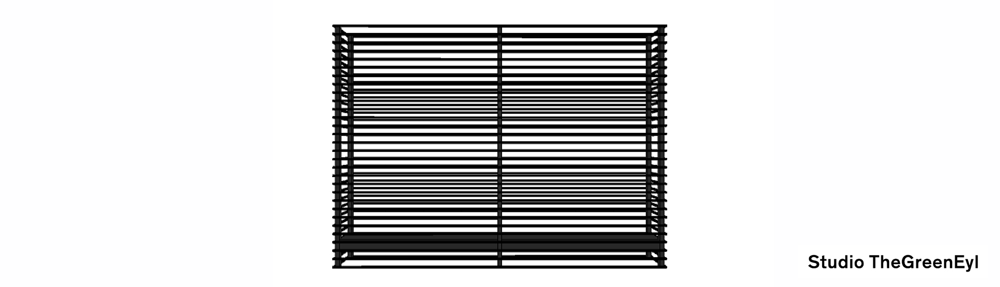
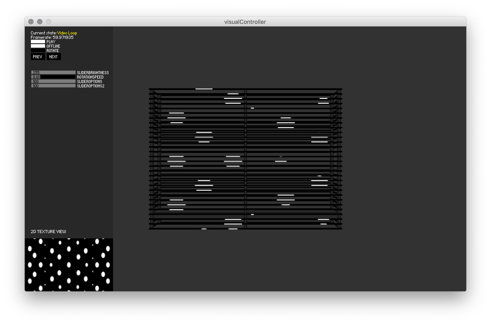

  

# Bauhaus Manifest

Proprietary software written in Processing.

## Status
Current version runs fine in Processing. The real-life application test is missing and can only be conducted in mid/end February 2019.

## Controls
- Control options can be found on the left side in the panel.
- 'Play' pause/unpause the animations. This freezes for real the demos but not the video (for now). Basically stops the redraw.
- 'Offline' start/stop sending messages over artnet.
- 'Rotate' the 3D manifest object
- 'Draw' draw/not draw the 3d object on screen
- 'Invert' invert brightness to create a negative image
- 'Sliderbrightness' controls the general brightness of the objects and all demos + LEDs
- 'Rotationspeed' sets the speed of the object when it rotates (for show off purposes)
- 'Slideroptions' + 'Slideroptions2' are used in various demos to control different parameters such as speed, thickness etc.

## Demos
- Demo 0: ("Video loop") Loads a video of the size 720x300 pixels
- Demo 1: ("Atmen") An implementation of the "Apple Breathing LED"
- Demo 2: ("Lichtstreifen") An adjustable light stripe wanders horizontally over the screen
- Demo 3: ("Hochwandern") An adjustable light stripe wanders vertically over the screen
- Demo 4: ("Soundreaktiv") Maps microphone input to brightness levels
- Demo 5: ("Perlin") Perlin Noise 3D. Slideroptions: Octave control from 0 – 8 / Slideroptions2: Falloff 0f – 1f
- Demo 6: ("Flocking") Flocking demo by D. Shiffman
- Demo 7: ("Ping pong") It's a ping pong demo?
- Demo 11: ("Perlin2") Something like stars. Pretty underperforming.

- **Rest of the Demos are not available yet**

  

## Dependencies
* [Artnet4j 0.4.0](https://github.com/cansik/artnet4j)
* [Processing Video 1.0.1+](https://github.com/processing/processing-video)
* [Controlp5 2.2.6](https://github.com/sojamo/controlp5/releases)
* [PeasyCam 3.0.2](http://mrfeinberg.com/peasycam/)
* [Processing Sound 1.0.1+](https://github.com/processing/processing-sound)

## Input
* Input has to be a H.264 conform "baseline" profile encode video, so it can run both on OSX and Linux machines.
* Images can be dropped into the data/img folder

An input movie is mapped to a rotatable 3D digital representation of the installation while over artnet 540 stripes (each equipped with 40 LEDs) from [SchnickSchnackSystems](https://schnick.schnack.systems/produkte/led-komponenten/led-streifen-m/) receive the same signals and display it on the *real* thing.

## Contributing

This is still a work in progress. Contributions are welcomed!

